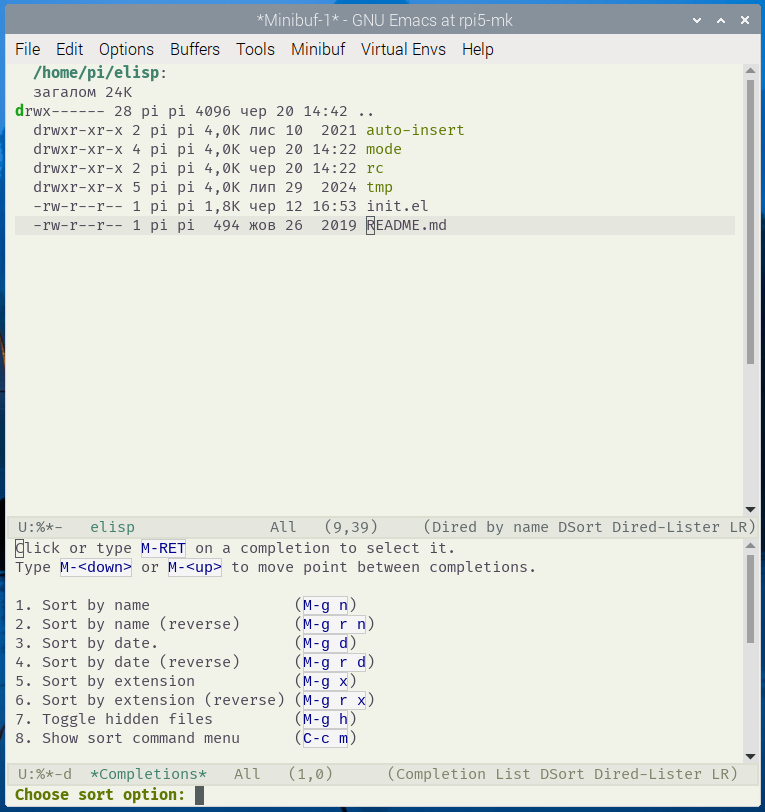

# dired-sort

`dired-sort` is an Emacs package that enhances the Dired file manager with flexible sorting options and control over hidden file visibility. It provides a global minor mode, `dired-sort-mode`, to streamline file navigation with a clean, aligned menu or completion interface for sorting commands.

## Features

- **Toggle Hidden Files**: Show or hide dotfiles (e.g., `.gitignore`) with a single keybinding, preserving the `..` entry when hidden files are disabled.
- **Flexible Sorting Options**:
  - Sort by name (alphabetically, normal or reverse).
  - Sort by modification date (newest or oldest first).
  - Sort by file extension (normal or reverse).
- **Directory Priority**: Directories always appear at the top, regardless of the sorting method.
- **Live Updates**: Sorting and visibility changes apply instantly without restarting Emacs.
- **Interactive Menus**: Choose sorting options via:
  - A numbered menu (`dired-sort-show-menu`) with highlighted current sort mode.
  - A completion-based interface (`dired-sort-show-completion`) for quick selection.
- **Automatic Buffer Updates**: Sorting updates automatically when switching Dired buffers or windows.
- **Customizable Keybindings**: Easily bind commands to preferred keys.

## Installation

### Manual Installation

1. Download `dired-sort.el` and place it in your Emacs load path (e.g., `~/.emacs.d/lisp/`).
2. Add the following to your Emacs configuration (`init.el`):

```emacs-lisp
(require 'dired-sort)
(dired-sort-mode 1)  ; Enable the global minor mode
```

### Via Package Manager (e.g., `use-package`)

If using `use-package`, add:

```emacs-lisp
(use-package dired-sort
  :ensure nil  ; Set to t if installed via a package repository
  :config
  (dired-sort-mode 1))
```

### Dependencies

- Emacs 24.4 or higher.
- `cl-lib` (included in Emacs 24.4+ for `cl-loop` and `cl-find`).

## Usage

1. **Enable the Mode**:

   ```emacs-lisp
   (require 'dired-sort)
   (dired-sort-mode 1)
   ```

2. Default Commands and Key Bindings

The following commands are available by default in `dired-sort.el`. You can invoke them via `M-x`, or bind them manually (see below).

| Command                          | Default Key Binding | Description                        |
|----------------------------------|----------------------|------------------------------------|
| `dired-sort-by-name`            | `M-g n`              | Sort files by name (ascending)     |
| `dired-sort-by-name-reverse`    | `M-g r n`            | Sort files by name (descending)    |
| `dired-sort-by-date`            | `M-g d`              | Sort by modification date (oldest) |
| `dired-sort-by-date-reverse`    | `M-g r d`            | Sort by modification date (newest) |
| `dired-sort-by-extension`       | `M-g x`              | Sort by file extension (A–Z)       |
| `dired-sort-by-extension-reverse`| `M-g r x`            | Sort by file extension (Z–A)       |
| `dired-sort-toggle-hidden`      | `M-g h`              | Toggle visibility of hidden files  |
| `dired-sort-show-menu`          | `C-c m`              | Show numbered sort menu            |
| `dired-sort-show-completion`    | `C-c c`              | Show `completing-read` sort menu   |

> You can use `(dired-sort-setup-keys)` to bind all default keys into `dired-mode-map`.

3. **Custom Keybindings**: Override defaults by defining your own keys:

   ```emacs-lisp
   (with-eval-after-load 'dired
     (dired-sort-setup-keys)
     (define-key dired-mode-map (kbd "C-c m") #'dired-sort-show-menu)
     (define-key dired-mode-map (kbd "C-c c") #'dired-sort-show-completion))
   ```

## Example Menu

### Numbered Menu (`C-c m`)

When you press `C-c m` (`dired-sort-show-menu`), you’ll see:


```text
Choose sort option:

 1  [ ] Sort by name                M-g n
 2  [ ] Sort by name (reverse)      M-g r n
 3  [ ] Sort by date                M-g d
 4  [ ] Sort by date (reverse)      M-g r d
 5  [ ] Sort by extension           M-g x
 6  [ ] Sort by extension (reverse) M-g r x
 7  [ ] Toggle hidden files         M-g h
 8  [ ] Show sort command menu      C-c m

Enter number:
```

- The asterisk `[*]` indicates the current sort mode.
- Enter a number (e.g., `1`) to apply the corresponding sort option.

### Completion Menu (`C-c c`)

When you press `C-c c` (`dired-sort-show-completion`), you’ll see a `completing-read` interface with options like:

```text
Choose sort option:
 1. Sort by name                (M-g n)
 2. Sort by name (reverse)      (M-g r n)
 3. Sort by date                (M-g d)
 4. Sort by date (reverse)      (M-g r d)
 5. Sort by extension           (M-g x)
 6. Sort by extension (reverse) (M-g r x)
 7. Toggle hidden files         (M-g h)
 8. Show sort command menu      (C-c m)
```

- Type a number, description, or part of the command name to select an option.
- Supports completion frameworks like Ivy, Helm, or Vertico for enhanced selection.

## Configuration

Customize the behavior via `M-x customize-group RET dired-sort`:

- `dired-sort-show-hidden`: Enable/disable hidden files by default (boolean).

To change the default sort switches or add custom options, modify `dired-sort-extra-switches` in your functions or advise `dired-sort--setup`.

## Notes

- The package uses GNU `ls` with `--group-directories-first` for sorting. Ensure your system’s `ls` (GNU coreutils) supports this option. If not, install `coreutils` or use `ls-lisp`:

  ```emacs-lisp
  (require 'ls-lisp)
  (setq ls-lisp-use-insert-directory-program nil)
  (setq ls-lisp-dirs-first t)
  ```

- The `..` entry is manually inserted when hidden files are disabled to maintain navigation convenience.
- Requires `cl-lib` for menu construction. If you prefer pure Lisp, contact the author for an alternative implementation.

## License

`dired-sort` is licensed under the GNU General Public License v3.0.

## Contributing

Contributions are welcome! Please submit issues or pull requests to the repository.

## Author

- Mykhailo Kazarian <michael.kazarian@gmail.com>
